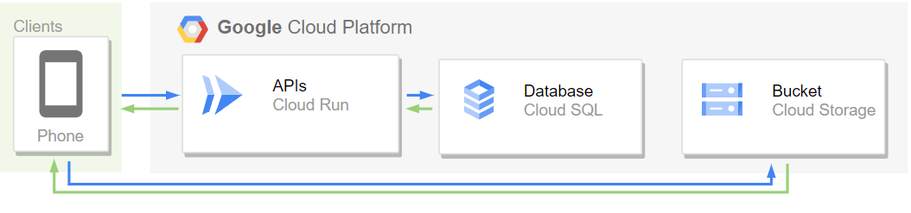

# Cloud Computing Team Members

| NAME | BANGKIT ID | UNIVERSITY | ROLE | GITHUB USERNAME |
| --- | --- | --- | --- | --- |
| Nugraha Varrel Kusumai | C296BSY3326 | Universitas Pembangunan Nasional Veteran Jawa Timur | CC | NugrahaVarrel |
| Lina Wardani | C296BSX3910 | Universitas Pembangunan Nasional Veteran Jawa Timur | CC | wardanilinaa14 |

## API for Aspald

Bangkit 2023 Capstone Project <br>

We're using NodeJS for developing this API and deploy it on Google CLoud Platform.

### Documentation
[Aspald API Documentation](https://documenter.getpostman.com/view/10017926/2s9Ykn8MkW)

## GCP Architecture



## Replicate our work

1. Create new Google Cloud project
2. Install Cloud Run API, Cloud Build API, & Cloud SQL API
3. Install and init Google Cloud SDK
4. Create MySQL instance on Google Cloud SQL
5. Give your MySQL instance to public access (you can use many ways to connect Cloud Run to Cloud SQL. For easier understanding, we're going to use public IP)
6. Connect to the instance and import Cloud SQL or Cloud Bucket
7. You may fill the database with some data
8. Clone this repo and go inside the folder
9. Create Database
    file path : src/api/v1/config/database.js
```javascript
module.exports = {
  development: {
    dialect: 'postgres',
    host: 'localhost',
    port: 5432,
    username: 'username',
    password: 'password',
    database: 'db',
  },
  production: {
    dialect: 'postgres',
    host: 'your_production_host',
    port: 5432,
    username: 'your_production_username',
    password: 'your_production_password',
    database: 'your_production_database',
  },
};
```
11. Run commands below
```plaintext
gcloud builds submit --tag gcr.io/<YOUR-GCP-PROJECT>/Flask-API
gcloud run deploy aruna \
--image=gcr.io/<YOUR-GCP-PROJECT>/Flask-API \
--set-env-vars=DB_HOST=<DB-IP>,DB_USER=<DB-USER>,DB_PASS=<DB-PASS>,DB_NAME=<DB-NAME> \
--region=asia-southeast2 \
--project=<YOUR-GCP-PROJECT>
```

10. Done
